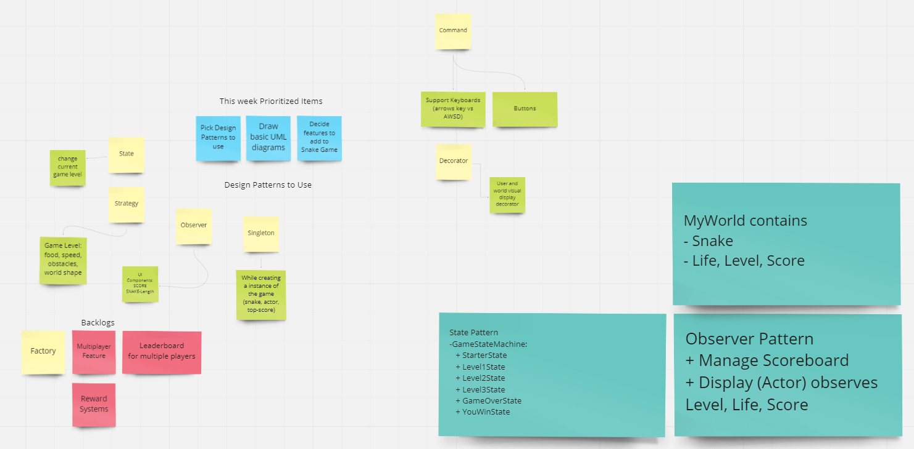

# Team M

High Level Plannng, Feature Breakdown

# Design Patterns

*Factory Pattern*

1. Used the factory pattern to create objects for different types of `foods` and `obstacles`
2. New objects are created using parent factory classes of `FoodFactory` and `ObstacleFactory`
3. As the game progresses and levels up, more obstacles and food options could be added by creating more classes implementing the same parent factory classes
4. In this way a common behaviour could be specified in the factory classes for future derive classes to be created
